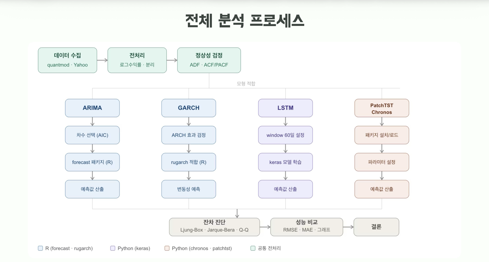

# S&P500 금융 시계열 예측 모델 비교 분석

S&P500 로그 수익률 데이터를 활용하여 전통적인 통계 기반 시계열 모델(ARIMA, GARCH)과 딥러닝 및 최신 Foundation Model(LSTM, PatchTST, Chronos)의 예측 성능을 비교·분석한 프로젝트입니다.

금융 데이터의 정상성 검정과 전처리를 수행한 후 각 모델을 적용하여 예측 결과와 성능을 비교하고, 금융 시계열 데이터에 적합한 예측 방법을 분석했습니다.

---

# 사용 기술

| 구분 | 기술 |
| --- | --- |
| Language | Python, R |
| Data | Yahoo Finance, quantmod |
| Data Processing | Pandas, NumPy |
| Statistical Model | ARIMA, GARCH |
| Deep Learning | TensorFlow, Keras (LSTM) |
| Transformer | PatchTST |
| Foundation Model | Chronos |
| Visualization | Matplotlib |
| Collaboration | GitHub |

---

# 데이터

| 항목 | 내용 |
| --- | --- |
| 데이터 | S&P500 Index |
| 출처 | Yahoo Finance |
| 분석 대상 | 일별 로그 수익률(Log Return) |

---

# 분석 파이프라인

---

# 프로젝트 목적

본 프로젝트는 금융 시계열 데이터의 특성을 분석하고, 전통적인 통계 기반 시계열 모델과 최신 딥러닝 모델, Foundation Model의 예측 성능을 비교하기 위해 수행되었습니다.

로그 수익률 데이터를 생성한 후 정상성 검정과 전처리를 수행하고, ARIMA, GARCH, LSTM, PatchTST, Chronos 모델을 적용하여 예측 성능과 각 모델의 특성을 비교·분석했습니다.

---

# 주요 수행 내용

- Yahoo Finance 데이터 수집
- 로그 수익률(Log Return) 생성
- 정상성 검정(ADF, ACF/PACF)
- ARIMA 모델 구축 및 최적 차수 선정
- GARCH 기반 변동성 분석
- LSTM 시계열 예측 모델 구현
- PatchTST Transformer 적용
- Amazon Chronos Foundation Model Zero-shot 예측
- RMSE, MAE 기반 성능 비교

---

# 결과 요약

| 모델 | 구분 | 특징 | RMSE | MAE |
| --- | --- | --- | ---: | ---: |
| **ARIMA(2,0,2)** | 통계 | 잔차 자기상관 거의 없음(Ljung-Box p=0.3218), ARCH 효과 존재 → GARCH 필요성 확인 | - | - |
| **GARCH(1,1)** | 통계 | α+β=0.997로 높은 변동성 지속성 확인, COVID-19·금리 인상 구간 변동성 포착 | - | - |
| **LSTM** | Deep Learning | 60일 입력 시퀀스, 2-Layer(64→32) + Dropout | **0.008232** | 0.006283 |
| **PatchTST** | Transformer | 16일 패치 토큰화, input_size=336 | 0.008565 | 0.006608 |
| **Chronos** | Foundation Model | amazon/chronos-t5-small, 추가 학습 없는 Zero-shot 예측 | **0.008165** | **0.006220** |

> **Chronos**가 추가 학습 없이도 가장 낮은 MAE를 기록했으며, **LSTM**과 유사한 수준의 예측 성능을 보였습니다. 전통적인 통계 모델은 예측 정확도보다는 데이터의 정상성 및 변동성 특성을 해석하는 데 강점을 확인할 수 있었습니다.

---

# 한계 및 향후 과제

- 잔차에 일부 구조가 남아 있어(Ljung-Box 일부 시차에서 유의), **ARMA 계열 모형만으로는 완전히 설명되지 않는 패턴**이 존재했습니다. 이를 통해 **GARCH와 같은 변동성 모형을 함께 고려할 필요성**을 확인했습니다.
- 현재는 **로그 수익률만 사용하는 단변량 예측**을 수행했습니다. 향후에는 **거시경제 지표, 금리, 거래량, 뉴스 센티먼트 등 외부 변수를 결합한 멀티모달 예측**을 수행할 계획입니다.
- Chronos는 **amazon/chronos-t5-small** 모델을 사용했습니다. 향후에는 **더 큰 모델(Chronos Large)** 또는 **금융 도메인 Fine-tuning**을 적용하여 성능 향상을 비교할 예정입니다.

---

# 프로젝트 정보

**개인 프로젝트**

---

# 만든 사람

**박지은**

- GitHub : https://github.com/jieunpark215
- Velog : https://velog.io/@parkjieun
